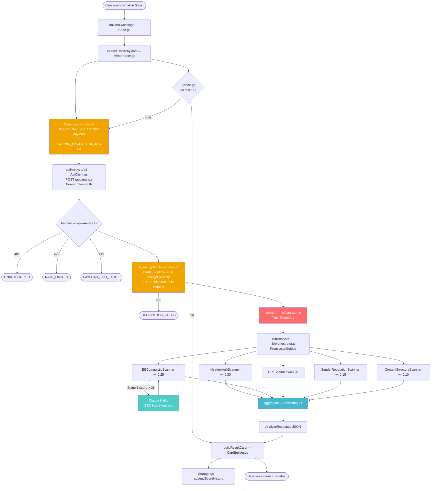

# Email Security Scorer

A Gmail Add-on built as a security engineering exercise for the Upwind Bootcamp assignment. It performs real-time, multi-dimensional threat analysis on every email you open — returning an explainable 0–100 maliciousness score with per-signal breakdowns, a personal stats dashboard, and a score-dispute mechanism.

This is a single-user, personal-use system. It is designed to demonstrate architectural thinking and security awareness, not to replace a production email security platform. Known gaps and the decisions behind them are documented honestly in the [Known Limitations](#known-limitations) section.

---

## Table of Contents

1. [The Problem](#the-problem)
2. [What It Does](#what-it-does)
3. [Architecture](#architecture)
4. [Scanners & Scoring](#scanners--scoring)
5. [Features](#features)
6. [Design Decisions & Tradeoffs](#design-decisions--tradeoffs)
7. [Known Limitations](#known-limitations)
8. [Setup Guide](#setup-guide)
   - [Prerequisites](#prerequisites)
   - [Step 1 — Clone & Install](#step-1--clone--install)
   - [Step 2 — Local Development with ngrok](#step-2--local-development-with-ngrok)
   - [Step 3 — Deploy to Vercel (Production)](#step-3--deploy-to-vercel-production)
   - [Step 4 — Deploy the Gmail Add-on](#step-4--deploy-the-gmail-add-on)
   - [Step 5 — Deploy the Stats Web App](#step-5--deploy-the-stats-web-app)
9. [Configuration Reference](#configuration-reference)
10. [Project Structure](#project-structure)
11. [Test Suite](#test-suite)

---

## The Problem

Business Email Compromise (BEC) caused **$2.9 billion in reported losses in 2023** (FBI IC3). The defining characteristic of BEC: **zero technical payload**. No malware, no suspicious links, no executable attachments — just precisely calibrated social engineering. Every signature-based email filter on the market is completely blind to it.

This system operates on two threat planes simultaneously:

| Plane | What it covers |
|---|---|
| **Structural / Technical** | SMTP authentication (SPF, DKIM, DMARC), header chain anomalies, URL homograph attacks, HTML smuggling primitives, attachment deception |
| **Semantic / Linguistic** | BEC urgency/authority/financial language patterns, AI-assisted BEC intent detection |

Modern commercial email security products (Proofpoint, Abnormal, Mimecast) cover both planes. The differentiating element here is the **layered prompt injection defense** — rule-based detection at Stage 1 and adversarial system-prompt hardening at the LLM stage — and the explicit reasoning about why each scanner weight was chosen.

---

## What It Does

When you open an email in Gmail, the add-on:

1. Extracts the full raw MIME payload (headers, body, attachment metadata)
2. Checks the local cache — if this email was analyzed within the last 30 minutes, the cached result is served instantly without a backend call
3. Optionally encrypts the payload end-to-end with HMAC-SHA256-CTR (`Crypto.gs`) before it leaves the browser — nonce derived via SIV (Synthetic IV) to avoid dependence on a CSPRNG
4. Posts it to a serverless analysis backend (Bearer token authenticated)
5. Decrypts and validates the payload server-side (`lib/encryption.ts`), then runs 5 independent scanners in parallel
6. Returns a 0–100 threat score, a risk level (LOW / MEDIUM / HIGH / CRITICAL), an explainable verdict, an actionable recommendation, and per-scanner signal breakdowns
7. Displays everything in a Gmail sidebar card
8. Stores the result locally for your personal stats dashboard

You can also dispute any score ("Dispute score" button → feedback form), and view all your history and feedback in a dedicated web dashboard.

---

## Architecture

```
Gmail contextual trigger (email opened)
        │
        ▼
Google Apps Script Add-on
  ├── MimeParser.gs      — raw MIME → structured payload
  ├── Crypto.gs          — (optional) HMAC-SHA256-CTR encrypt payload before sending
  ├── ApiClient.gs       — authenticated POST to backend
  ├── CardBuilder.gs     — Gmail sidebar card UI
  ├── Storage.gs         — per-user history & feedback (PropertiesService)
  └── WebApp.gs          — serves the stats HTML dashboard
        │  JSON over HTTPS · Bearer token auth · (optional) encrypted payload
        ▼
Vercel Serverless Function  (TypeScript, Node.js)
  ├── api/analyze.ts     — auth · rate-limit · size guard · decrypt · validate
  ├── lib/encryption.ts  — (optional) HMAC-SHA256-CTR decrypt & verify payload
  ├── lib/sanitizer.ts   — trust boundary: raw request → safe EmailContext
  ├── lib/orchestrator.ts— 5 scanners, Promise.allSettled (parallel)
  └── lib/scoring.ts     — weighted aggregation + amplification rules
        │  JSON response
        ▼
Gmail Sidebar Card
  └── finalScore | riskLevel | verdict | topSignals | per-scanner breakdown
```



---

## Scanners & Scoring

### Five Independent Scanners

Each scanner runs inside its own timeout and try/catch. A failure in one never blocks the others. The response always includes all available results plus a `partialAnalysis: true` flag if any scanner errored.

| Scanner | Weight | Timeout | Detection Scope |
|---|---|---|---|
| **HeaderAuthScanner** | 30% | 4 s | SPF/DKIM/DMARC failures, Received chain anomalies, DKIM domain misalignment, SMTP smuggling indicators |
| **BECLinguisticScanner** | 25% | 8 s | Rule-based urgency/authority/financial patterns (Stage 1), Claude Haiku LLM analysis (Stage 2, gated on Stage 1 score > 25) |
| **URLScanner** | 20% | 5 s | Punycode/homograph attacks, typosquatting (Levenshtein distance), HTML smuggling JS primitives, subdomain confusion |
| **SenderReputationScanner** | 15% | 7 s | Lookalike sender domains, Reply-To hijacking, display name spoofing, free-provider + financial keyword combos, **domain age via RDAP** (< 30 days = CRITICAL, < 90 days = HIGH) |
| **ContentStructureScanner** | 10% | 4 s | Dangerous attachment extensions, double-extension attacks, MIME deep nesting, zero-font CSS concealment |

### Scoring Algorithm

```
baseScore = Σ(scanner.score × scanner.weight)

# Critical override: any CRITICAL-severity signal sets score floor at 70
if any signal.severity == CRITICAL → baseScore = max(baseScore, 70)

# Corroboration boost: ≥3 scanners independently agree on threat
if ≥3 scanners score > 50 → baseScore = min(100, baseScore × 1.2)

# Weak corroboration floor: 2+ scanners flag HIGH/CRITICAL signals
if ≥2 scanners have HIGH/CRITICAL signals → baseScore = max(baseScore, 40)

# Authentication attenuation: strong auth + clean language reduces false positives
if HeaderAuth.score < 10 AND BECLinguistic.score < 20 → baseScore × 0.8

finalScore = clamp(round(baseScore), 0, 100)

Risk levels:  CRITICAL ≥ 70  |  HIGH 55–69  |  MEDIUM 35–54  |  LOW 0–34
```

Verdicts and recommendations are **template-selected server-side** — never LLM-generated. This is a deliberate security decision: adversarial email content cannot manipulate the verdict or recommendation text through prompt injection.

Each risk level maps to a fixed actionable recommendation:

| Risk Level | Recommendation |
|---|---|
| **CRITICAL** | Do not click any links, open attachments, or reply. Verify the request by calling the sender on a known phone number. Report as phishing. |
| **HIGH** | Do not follow any instructions without first verifying the sender's identity through a separate channel. Do not click links or open attachments. |
| **MEDIUM** | Proceed with caution. Confirm the sender's identity before sharing information or taking financial action. |
| **LOW** | No action required. Standard email hygiene applies. |

---

## Features

### Real-time Email Scoring
Every email opened in Gmail is automatically analyzed. Results are cached per-message for 30 minutes — re-opening the same email is instant with no backend call. The sidebar card shows:
- Final score (0–100) and risk level with color-coded badge
- Explainable verdict paragraph
- **"What To Do"** — a concrete, actionable recommendation based on the risk level (e.g., "Do not click any links. Verify the sender by phone.")
- Top threat signals with severity labels
- Collapsible per-scanner breakdown ("Why this score?")
- Re-analyze button (bypasses cache for a fresh analysis)

### Score Dispute / Feedback
If you believe a score is wrong, click **"Dispute score"** on the result card. A form lets you:
- Select what you think the correct risk level should be
- Leave a free-text comment explaining why

Feedback is stored locally in Google's infrastructure under your account and visible in the stats dashboard.

### Personal Stats Dashboard (in-sidebar)
Click **"My Stats"** from any result card to see an aggregated view:
- Total emails analyzed
- Average threat score
- Breakdown by risk level (Critical / High / Medium / Low)
- Recent history (last 10 emails)

### Stats Web Dashboard (full browser page)
Click **"Open Stats Dashboard"** to open a full-page HTML dashboard with:
- KPI cards: total analyzed, average score, critical+high count, feedbacks given
- Risk distribution bar chart
- Complete email history table (all analyzed emails, with date, sender, subject, score, risk)
- Complete feedback table (all disputes submitted, with original score, suggested risk, comment)

All data is stored in Google Apps Script's `PropertiesService.getUserProperties()` — scoped to your Google account, held in Google's infrastructure, never sent anywhere outside the analysis API call.

---

## Design Decisions & Tradeoffs

### Serverless Functions over a Persistent Express Server
**Decision:** Each analysis is a stateless Vercel serverless function invocation.

**Why:** Forced statelessness eliminates an entire class of server-side attacks. There is no persistent process holding secrets in memory between requests, no session state to hijack, and no middleware chain that could leak data across concurrent requests. Every invocation starts cold with only the environment variables it needs.

**Tradeoff:** The in-memory rate limiter resets on cold start. Acceptable for personal/single-user deployment; a multi-tenant system would need Redis or Vercel KV for persistent rate limiting.

---

### Google Apps Script over a Chrome Extension
**Decision:** The Gmail integration is built as a GAS contextual add-on, not a browser extension.

**Why:** Contextual triggers give access to the **full raw MIME message** via `GmailApp.getMessageById()`. A Chrome extension can only see the rendered DOM — which Gmail has already processed and partially sanitized. SMTP smuggling indicators, raw `Received` header chains, and MIME structure anomalies are only visible in the raw MIME. The raw MIME is where the truth lives.

**Tradeoff:** Apps Script is synchronous-only, has strict execution time limits (30s), and requires OAuth approval. A Chrome extension would have been faster to build but fundamentally less capable.

---

### LLM Analysis Gated Behind Rule-Based Stage 1
**Decision:** `BECLinguisticScanner` only invokes Claude when the Stage 1 rule score exceeds 25.

**Why:**
- **Cost control:** Most legitimate emails score 0 at Stage 1. Gating eliminates ~80% of LLM API calls.
- **Prompt injection surface reduction:** The LLM only sees emails already flagged as suspicious. Input is sanitized plain text (never HTML), wrapped in XML delimiters, and schema-validated. The LLM's score contribution is also capped at a 40% blend weight — it cannot single-handedly determine the final verdict.

**Tradeoff:** A sophisticated BEC email that deliberately avoids all rule-based patterns (very rare) could escape Stage 1 gating. A production system would add a lightweight ML classifier as an additional gate.

---

### Maximum-Score Aggregation within Scanners
**Decision:** Overlapping signals within a single scanner use `score = Math.max(score, newFloor)`, not additive accumulation.

**Why:** Multiple detections of the same underlying threat (e.g., both homograph AND typosquat on the same URL) should not inflate the score beyond what the threat actually warrants. Cross-scanner amplification (the corroboration boost) is handled by the scoring engine when independent scanners agree.

---

### Pre-Shared Secret over Per-User OAuth
**Decision:** Authentication between the add-on and backend uses a single shared `ADDON_API_SECRET` (Bearer token), not per-user OAuth.

**Why:** This is a personal-use deployment. Per-user OAuth would require a Google Cloud OAuth app, a token exchange endpoint, refresh logic, and token storage — significant complexity for a single user.

**Tradeoff:** All requests from the add-on are authenticated with the same token. If the token leaks, it must be rotated in both Vercel env vars and Apps Script Script Properties simultaneously. A multi-tenant production system would replace this with per-user Google OAuth tokens.

---

### PropertiesService for User Data (No Database)
**Decision:** Score history, feedback, and stats are stored in Google Apps Script's `PropertiesService.getUserProperties()`, not a database.

**Why:** Zero infrastructure overhead, zero cost, automatic per-user scoping, and data lives inside Google's infrastructure alongside the add-on itself. Sufficient capacity (500 KB per user ≈ thousands of analyzed emails).

**Tradeoff:** Data is not queryable server-side, not shareable across devices outside the same Google account, and would be lost if the script project is deleted. A production system would use a database (e.g., Supabase or Upstash Redis) with user identity derived from Google OAuth tokens, enabling cross-device sync, server-side analytics, and LLM-generated reports over accumulated data over time.

---

### Optional Payload Encryption
**Decision:** The request payload can be HMAC-SHA256-CTR encrypted end-to-end if `PAYLOAD_ENCRYPTION_KEY` is set in both the add-on and the backend. Three subkeys are derived from the master key via HMAC (`encryption`, `authentication`, `nonce`). The nonce is derived deterministically using a SIV (Synthetic IV) construction: `HMAC(nonceKey, plaintext)[0:16]`.

**Why:** Apps Script exposes no native CSPRNG — `Math.random()` is xorshift128+ seeded by the system clock and is unsuitable for cryptographic nonce generation. The SIV construction eliminates this dependency entirely. Nonce reuse only occurs if the exact same payload is sent twice with the same key, which reveals only that an identical message was sent — not its content. Security reduces to the same PRF assumption required by the MAC.

**Tradeoff:** Optional — requires the same key in two places. Disabled by default to reduce setup friction.

---

## Known Limitations

### Cryptographic

**SIV nonce derivation (`Crypto.gs`)** — The nonce is derived deterministically as `HMAC(nonceKey, plaintext)[0:16]`. Nonce reuse occurs only if the exact same plaintext is encrypted twice with the same key, which reveals only that an identical message was sent — not its content. A production implementation could XOR the derived nonce with a value from `Utilities.getUuid()` to add unpredictability without introducing a CSPRNG dependency.

### Detection Gaps

**No attachment content scanning** — only metadata (name, MIME type, size) is analyzed. Content detonation requires an isolated sandbox (e.g., AWS Lambda with no outbound network access) and a dedicated malware analysis pipeline.

**No image analysis / OCR** — malicious content embedded in images is invisible to all scanners. This includes QR code phishing (attacker embeds a QR code that links to a credential-harvesting page), which is one of the most active current attack vectors precisely because it bypasses URL-based scanners entirely.

**SMTP smuggling heuristic has limited coverage** — the `SMTP_SMUGGLING_INDICATOR` signal looks for a bare-LF DATA terminator in the raw header block. Gmail's MTA strips the SMTP DATA protocol layer before message delivery, so this pattern fires rarely in practice. It is retained as a structural placeholder for environments where raw SMTP capture is available.

### Architecture

**Expert-tuned weights, not ML-derived** — the 30/25/20/15/10 scanner weight distribution reflects domain knowledge, not a trained model. A production system would derive weights via logistic regression on a labeled phishing/legitimate corpus, and retrain as threat landscape evolves.

**Rate limiting resets on cold start** — the in-memory rate limiter is appropriate for single-user deployment. Multi-tenant deployment requires a persistent store (Redis, Vercel KV) to survive Vercel function cold starts.

**Per-user data is not portable** — score history and feedback live in `PropertiesService.getUserProperties()`, scoped to the Google account that authorized the add-on. Data is not queryable server-side, not exportable without custom tooling, and would be lost if the Apps Script project is deleted.

**Feedback loop is local-only** — the "Dispute score" form stores corrections inside the same `PropertiesService` store. Only the user can see their own feedback; there is no mechanism for the operator to aggregate disputes and improve the model. A production system would POST feedback to a server-side store keyed on a stable user identifier, enabling supervised retraining of scanner weights over time.

### LLM

**Prompt injection is mitigated, not eliminated** — schema validation, plain-text-only input, XML delimiters, and the 40% blend-weight cap significantly reduce the attack surface, but a fine-tuned classification model would be more robust than a general-purpose LLM against carefully crafted adversarial inputs.

---

## Setup Guide

### Option A — Use the Live Backend (Recommended for Reviewers)

A production deployment is running at:

```
https://upwind-email-scorer.vercel.app
```

Verify it is live:

```bash
curl https://upwind-email-scorer.vercel.app/api/health
# Expected: {"status":"ok","version":"1.0.0","scanners":[...]}
```

If you only want to evaluate the add-on without running your own backend, you only need to configure the Gmail Add-on (Steps 4–5 below) and point it at this URL. The credentials (`ADDON_API_SECRET` and `PAYLOAD_ENCRYPTION_KEY`) are not committed to the repository — they will be provided verbally at the interview or by direct email on request.

---

### Option B — Self-Host (Full Setup)

Follow the steps below if you want to run your own backend instance.

### Prerequisites

Before you begin, make sure you have:

- **Node.js** v18+ and **npm** installed
- **Vercel CLI** installed globally: `npm install -g vercel`
- **Clasp** (Google Apps Script CLI) installed globally: `npm install -g @google/clasp`
- A **Google account** with Gmail
- An **Anthropic API key** — get one at [console.anthropic.com](https://console.anthropic.com)
- **ngrok** installed — download from [ngrok.com/download](https://ngrok.com/download) (free account required for stable URLs)

---

### Step 1 — Clone & Install

```bash
git clone https://github.com/Guysu123/email-security-scorer.git
cd email-security-scorer

# Install backend dependencies
cd backend
npm install
```

---

### Step 2 — Local Development with ngrok

This lets you run the analysis backend on your machine and connect it to the Gmail Add-on through a public HTTPS tunnel.

#### 2a. Create the local environment file

```bash
# In the backend/ directory
cp ../.env.example .env.local
```

Open `backend/.env.local` and fill in the values:

```env
# A random secret shared between the add-on and the backend.
# Generate one with:  openssl rand -hex 32
ADDON_API_SECRET=<paste your generated secret here>

# Your Anthropic API key (enables BEC LLM analysis)
ANTHROPIC_API_KEY=sk-ant-...

# Optional — set to "debug" to see verbose logs in the Vercel dev console
LOG_LEVEL=info
```

> **Important:** `ADDON_API_SECRET` must be at least 32 characters. Use `openssl rand -hex 32` to generate a cryptographically random value. You will use this same value in two places: `.env.local` (backend) and Apps Script Script Properties (add-on).

#### 2b. Start the local backend server

```bash
# In the backend/ directory
npx vercel dev
# Server starts at http://localhost:3000
```

Verify it is running:
```bash
curl http://localhost:3000/api/health
# Expected: {"status":"ok","version":"1.0.0", ...}
```

#### 2c. Expose it publicly with ngrok

Open a **second terminal** and run:

```bash
ngrok http 3000
```

ngrok will print output like this:

```
Forwarding   https://a1b2c3d4.ngrok-free.app -> http://localhost:3000
```

**Copy the `https://...ngrok-free.app` URL.** You will paste this into Apps Script as `BACKEND_URL` in the next step. Keep both terminals running while developing.

> **Note:** Free ngrok URLs change every time you restart ngrok. Each time you restart, update `BACKEND_URL` in Apps Script Script Properties.

---

### Step 3 — Deploy to Vercel (Production)

When you're ready to run the backend permanently (without ngrok), deploy it to Vercel.

#### 3a. Deploy

```bash
# In the backend/ directory
vercel deploy --prod
```

Vercel will print your deployment URL, e.g.:
```
https://your-project-name.vercel.app
```

#### 3b. Set environment variables in Vercel

Go to your project on [vercel.com](https://vercel.com) → **Settings → Environment Variables** and add:

| Variable | Value | Required |
|---|---|---|
| `ADDON_API_SECRET` | Same value as in `.env.local` | ✅ Yes |
| `ANTHROPIC_API_KEY` | Your Anthropic API key | ✅ Yes |
| `PAYLOAD_ENCRYPTION_KEY` | A 64-char hex string (`openssl rand -hex 32`) | ⬜ Optional |
| `LOG_LEVEL` | `info` or `debug` | ⬜ Optional |

After adding variables, redeploy:
```bash
vercel deploy --prod
```

Verify:
```bash
curl https://your-project-name.vercel.app/api/health
# Expected: {"status":"ok","version":"1.0.0", ...}
```

---

### Step 4 — Deploy the Gmail Add-on

#### 4a. Log in to clasp

```bash
npx @google/clasp login
# Opens a browser — authorize with your Google account
```

#### 4b. Push the add-on code

```bash
# In the addon/ directory
cd ../addon
npx @google/clasp push
# Confirm with "Yes" when prompted about the manifest
```

#### 4c. Set Script Properties

These are the add-on's runtime secrets. They are stored encrypted by Google inside your Apps Script project.

1. Open [script.google.com](https://script.google.com) and open the project (or use the link printed by clasp)
2. Click the gear icon ⚙ → **Project Settings → Script Properties**
3. Click **"Add script property"** for each of the following:

| Property | Value | Required |
|---|---|---|
| `ADDON_API_SECRET` | Exact same value you put in `.env.local` / Vercel | ✅ Yes |
| `BACKEND_URL` | Your Vercel URL (prod) **or** your ngrok URL (dev), e.g. `https://your-project.vercel.app` | ✅ Yes |
| `PAYLOAD_ENCRYPTION_KEY` | Same 64-char hex string as Vercel (only if you set it there) | ⬜ Optional |
| `STATS_WEBAPP_URL` | Web app URL from Step 5 below — leave blank for now | ⬜ Optional |

> **Switching between local dev and production:** Change `BACKEND_URL` to your ngrok URL for local testing, and back to the Vercel URL for production. Everything else stays the same.

#### 4d. Create a test deployment

1. In the Apps Script editor: **Deploy → Test deployments**
2. Click **Install** — this installs the add-on into your Gmail account
3. Open Gmail — the add-on panel should appear on the right when you open any email

#### 4e. Create a production deployment (optional)

If you want a stable deployment (not the "HEAD" test deployment):

1. **Deploy → New deployment**
2. Type: **Add-on**
3. Click **Deploy**
4. Note the deployment ID — you may need it if publishing to the Workspace Marketplace later

---

### Step 5 — Deploy the Stats Web App

The stats dashboard (`Stats.html`) is served as a separate web app from the same Apps Script project. This unlocks the **"Open Stats Dashboard"** button in the add-on.

#### 5a. Create the web app deployment

1. In the Apps Script editor: **Deploy → New deployment**
2. Click the gear icon ⚙ next to "Select type" → choose **Web app**
3. Set:
   - **Execute as:** Me
   - **Who has access:** Only myself
4. Click **Deploy**
5. Copy the URL — it looks like:
   ```
   https://script.google.com/macros/s/AKfycb.../exec
   ```

#### 5b. Save the URL as a Script Property

1. Go back to **Project Settings → Script Properties**
2. Add (or update):

| Property | Value |
|---|---|
| `STATS_WEBAPP_URL` | The `https://script.google.com/macros/s/.../exec` URL from above |

#### 5c. Push and redeploy the add-on

```bash
npx @google/clasp push
```

Then in the Apps Script editor:
- **Deploy → Manage deployments** → edit the existing **Add-on** deployment → set **Version** to "New version" → **Deploy**

The "Open Stats Dashboard" button will now appear on the result card and the in-card stats view.

> **Note:** The web app URL is stable — it only changes if you create a brand-new deployment. Re-deploying an existing deployment with a new version keeps the same URL.

---

## Configuration Reference

### Backend environment variables

Set in `backend/.env.local` for local development. Set in the **Vercel dashboard** (Settings → Environment Variables) for production.

| Variable | Description | Where to get it | Required |
|---|---|---|---|
| `ADDON_API_SECRET` | Pre-shared secret authenticating the add-on to the backend. Must match the value in Apps Script Script Properties. | Generate: `openssl rand -hex 32` | ✅ Yes |
| `ANTHROPIC_API_KEY` | Anthropic API key for the BEC Linguistic Scanner's LLM stage. | [console.anthropic.com](https://console.anthropic.com) | ✅ Yes |
| `PAYLOAD_ENCRYPTION_KEY` | Optional HMAC-SHA256-CTR encryption key for the request payload. Adds a second confidentiality layer on top of HTTPS. Must match the Apps Script `PAYLOAD_ENCRYPTION_KEY`. | Generate: `openssl rand -hex 32` | ⬜ Optional |
| `LOG_LEVEL` | Logging verbosity: `debug`, `info`, `warn`, or `error`. | — | ⬜ Optional (default: `info`) |

### Apps Script Script Properties

Set in **Apps Script editor → Project Settings → Script Properties**. Never committed to source control.

| Property | Description | Required |
|---|---|---|
| `ADDON_API_SECRET` | Pre-shared secret. **Must exactly match** the backend `ADDON_API_SECRET` env var. | ✅ Yes |
| `BACKEND_URL` | The base URL of your backend. Use the Vercel production URL normally; switch to your ngrok URL for local development. Do **not** include a trailing slash. Example: `https://your-project.vercel.app` | ✅ Yes |
| `PAYLOAD_ENCRYPTION_KEY` | Optional encryption key. **Must exactly match** the backend `PAYLOAD_ENCRYPTION_KEY` env var if set. Leave unset on both sides to disable encryption. | ⬜ Optional |
| `STATS_WEBAPP_URL` | The Apps Script web app URL (`https://script.google.com/macros/s/.../exec`). Enables the "Open Stats Dashboard" button. See Step 5. | ⬜ Optional |

> **`BACKEND_URL` for local dev vs. production:**
> - Local: `https://a1b2c3d4.ngrok-free.app` (your current ngrok URL)
> - Production: `https://your-project.vercel.app`
>
> There is no separate `DEV_URL` property — you simply swap `BACKEND_URL` between the two values as needed.

---

## Project Structure

```
email-security-scorer/
│
├── addon/                            # Google Apps Script (deployed via clasp)
│   ├── appsscript.json               # Manifest: scopes, triggers, URL allowlist
│   ├── Code.gs                       # Entry points: onGmailMessage, onHomepage, feedback handlers
│   ├── CardBuilder.gs                # All Gmail sidebar card UI construction
│   ├── MimeParser.gs                 # Raw MIME → structured AnalyzeRequest payload
│   ├── ApiClient.gs                  # Authenticated HTTP client for POST /api/analyze
│   ├── Cache.gs                      # Per-user 30-min result cache (PropertiesService)
│   ├── Storage.gs                    # Score history & feedback persistence (PropertiesService)
│   ├── WebApp.gs                     # doGet() + getStatsData() — serves the stats dashboard
│   ├── Stats.html                    # Full-page HTML stats dashboard
│   ├── Crypto.gs                     # Optional HMAC-SHA256-CTR payload encryption (SIV nonce — no CSPRNG dependency)
│   └── Constants.gs                  # Runtime config helpers (BACKEND_URL, ADDON_VERSION, etc.)
│
├── backend/
│   ├── __tests__/                    # Unit tests (Vitest, no backend required)
│   │   ├── punycode.test.ts          # Typosquat / homograph / subdomain-confusion edge cases
│   │   ├── scoring.test.ts           # Weighted aggregation, risk level thresholds, override rules
│   │   └── html.test.ts              # HTML smuggling detection, URL extraction, XSS escaping
│   ├── api/
│   │   ├── analyze.ts                # POST /api/analyze — auth · rate-limit · validate · dispatch
│   │   └── health.ts                 # GET /api/health
│   ├── lib/
│   │   ├── types.ts                  # All TypeScript interfaces (AnalyzeRequest, AnalyzeResponse, etc.)
│   │   ├── sanitizer.ts              # Trust boundary: untrusted request → safe EmailContext
│   │   ├── orchestrator.ts           # Parallel scanner execution via Promise.allSettled
│   │   ├── scoring.ts                # Weighted aggregation + amplification rules + verdict selection
│   │   ├── encryption.ts             # Server-side HMAC-SHA256-CTR payload decryption
│   │   └── logger.ts                 # Structured JSON logging (no PII in logs)
│   ├── scanners/
│   │   ├── base.ts                   # Abstract BaseScanner: timeout isolation, signal builder
│   │   ├── HeaderAuthScanner.ts      # SPF / DKIM / DMARC / Received chain (weight 0.30)
│   │   ├── BECLinguisticScanner.ts   # Rule-based Stage 1 + Claude Haiku Stage 2 (weight 0.25)
│   │   ├── URLScanner.ts             # Homograph, typosquat, HTML smuggling (weight 0.20)
│   │   ├── SenderReputationScanner.ts# Display name / domain spoofing (weight 0.15)
│   │   └── ContentStructureScanner.ts# Attachments, MIME nesting, CSS tricks (weight 0.10)
│   ├── utils/
│   │   ├── claude.ts                 # Anthropic SDK wrapper — schema-validated BEC analysis
│   │   ├── html.ts                   # HTML smuggling detection + entity escaping
│   │   ├── punycode.ts               # Homograph/typosquat detection (Levenshtein distance)
│   │   └── domainAge.ts              # RDAP domain registration date lookup
│   ├── vercel.json                   # Function timeouts: 30 s for /api/analyze, 5 s for /api/health
│   ├── package.json
│   └── tsconfig.json
│
├── test/                             # Batch runner + LLM judge test suite
│   ├── batch/
│   │   ├── runner.ts                 # Runs test cases against the live API
│   │   ├── report.ts                 # Prints pass/fail summary
│   │   └── cases/
│   │       ├── phishing.ts           # Known phishing email test cases
│   │       ├── bec.ts                # BEC test cases (no technical payload)
│   │       └── benign.ts             # Legitimate email test cases (false-positive guard)
│   ├── llm-judge/
│   │   ├── judge.ts                  # Claude-based LLM judge for scoring quality
│   │   ├── rubric.ts                 # Evaluation rubric
│   │   └── samples.ts                # Sample emails for judge evaluation
│   ├── types.ts
│   └── package.json
│
├── .env.example                      # Template for backend/.env.local
├── DOCUMENTATION.md                  # Full API reference and technical specification
└── .gitignore
```

---

## Security Highlights

| Concern | Mitigation |
|---|---|
| **API authentication** | `crypto.timingSafeEqual` Bearer token comparison (constant-time, prevents timing attacks) |
| **Rate limiting** | 60 req/hr keyed on SHA-256(token) — raw token never appears in logs |
| **Input size** | 500 KB request cap; per-field limits on headers (64 KB), plain text (50 KB), HTML (200 KB) |
| **Header injection** | `\r\n` stripped from all string fields in the sanitizer trust boundary |
| **XSS in evidence strings** | All `Signal.evidence` values HTML-entity-escaped before serialization |
| **Prompt injection** | Plain text only to LLM; XML delimiters; schema validation; 40% blend-weight cap |
| **Secret storage** | Vercel env vars (backend) + Apps Script ScriptProperties (add-on); never in source |
| **Scope minimization** | Add-on requests `gmail.readonly` only — zero write permissions to your mailbox |
| **URL fetch allowlist** | `urlFetchWhitelist` in `appsscript.json` restricts `UrlFetchApp` to the backend domain |
| **Payload encryption nonce** | SIV (Synthetic IV) — nonce derived as `HMAC(nonceKey, plaintext)[0:16]`; no CSPRNG dependency, no `Math.random()` |

---

## Test Suite

### Unit Tests (no backend required)

Pure-function unit tests live in `backend/__tests__/`. They run offline in milliseconds with [Vitest](https://vitest.dev/).

```bash
cd backend
npm test
# 37 tests across 3 files — punycode, scoring engine, HTML detection
```

| File | What it tests |
|---|---|
| `__tests__/punycode.test.ts` | `checkTyposquat`, `checkHomograph`, `checkSubdomainConfusion` — Levenshtein edge cases, digit substitutions, punycode label extraction |
| `__tests__/scoring.test.ts` | `scoreToRiskLevel` thresholds, `aggregate` weighted average, CRITICAL signal override, corroboration boost, signal ordering |
| `__tests__/html.test.ts` | `detectHtmlSmuggling` (all 5 primitives), `extractUrls`, `escapeHtml` XSS cases |

### Integration Tests (live backend required)

The `test/` directory contains a batch runner and an LLM judge that run against a live deployed API.

```bash
cd test
npm install

# Run batch tests against a live backend
TEST_API_URL=https://your-project.vercel.app \
TEST_API_TOKEN=your_secret \
npx tsx batch/runner.ts

# Run the LLM judge evaluation
ANTHROPIC_API_KEY=sk-ant-... npx tsx llm-judge/judge.ts
```

The batch runner sends real email payloads (phishing, BEC, benign) to the API and asserts expected score ranges. The LLM judge uses Claude to evaluate whether the signals and verdict are coherent and accurate for each result.

---

*Built for the Upwind Security Bootcamp assignment. The core argument: BEC — the highest-loss email attack category — leaves no technical payload for signature-based scanners to find. Catching it requires operating simultaneously on the structural plane (headers, URLs, attachments) and the semantic plane (linguistic intent, pressure patterns). The interesting engineering decision is how to combine the two without letting the LLM stage become an attack surface of its own.*
