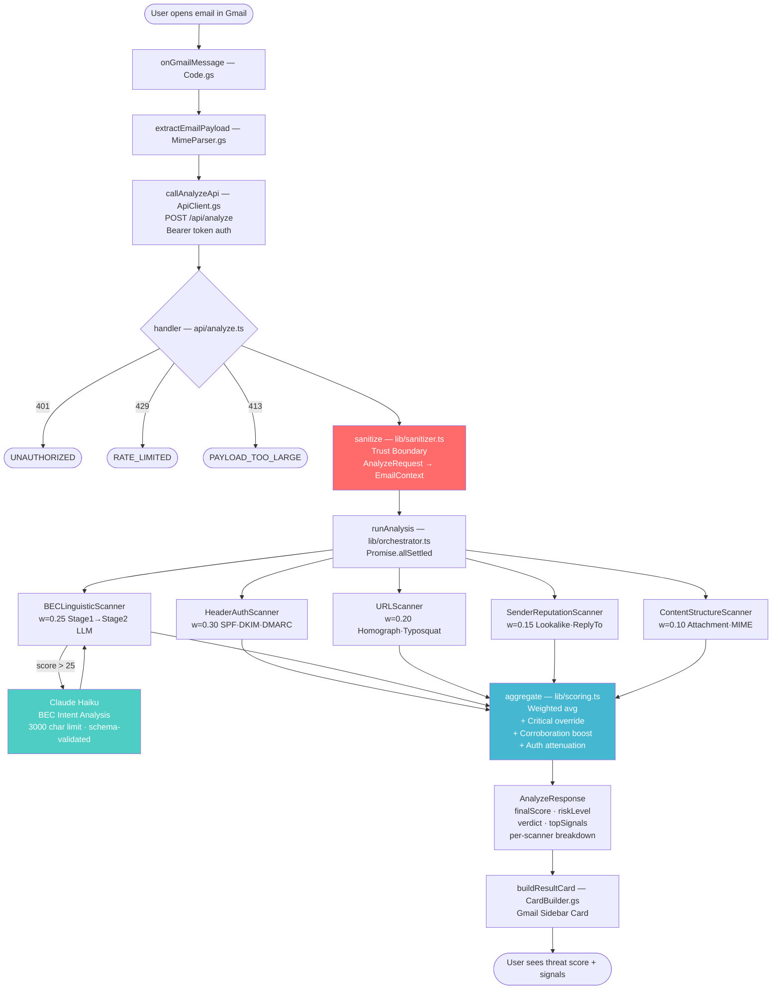

# Email Security Scorer

A production-grade Gmail Add-on that performs real-time, multi-dimensional threat analysis on every email you open — returning a 0–100 maliciousness score with a per-signal, explainable verdict.

---

## The Problem

Business Email Compromise (BEC) caused **$2.9 billion in reported losses in 2023** (FBI IC3). The defining characteristic of BEC: **zero technical payload**. No malware. No suspicious links. No executable attachments. Just precisely calibrated social engineering — and every signature-based email filter on the market is completely blind to it.

This system operates on two threat planes simultaneously:

| Plane | What it covers |
|---|---|
| **Structural / Technical** | SMTP authentication (SPF, DKIM, DMARC), header chain anomalies, URL homograph attacks, HTML smuggling primitives, attachment deception |
| **Semantic / Linguistic** | BEC urgency/authority/financial language patterns, feature starvation, AI-assisted BEC intent detection |

Most commercial email security products only cover the structural plane. This architecture covers both.

---

## Architecture

```
Gmail contextual trigger (email opened)
        │
        ▼
Apps Script Add-on
  ├── MimeParser.gs     — raw MIME → structured payload
  └── ApiClient.gs      — authenticated POST to backend
        │  JSON over HTTPS
        ▼
Vercel Serverless Function (TypeScript)
  ├── sanitizer.ts      — trust boundary (raw request → safe EmailContext)
  ├── orchestrator.ts   — 5 scanners run in parallel (Promise.allSettled)
  └── scoring.ts        — weighted aggregation + amplification rules
        │  JSON response
        ▼
Gmail Sidebar Card
  └── finalScore | riskLevel | verdict | per-scanner breakdown | topSignals
```

### Five Independent Scanners (run in parallel)

| Scanner | Weight | Detection Scope |
|---|---|---|
| **HeaderAuthScanner** | 30% | SPF/DKIM/DMARC failures, Received chain anomalies, SMTP Smuggling indicators, DKIM domain misalignment |
| **BECLinguisticScanner** | 25% | Rule-based urgency/authority/financial patterns (Stage 1), Claude Haiku LLM analysis (Stage 2, gated) |
| **URLScanner** | 20% | Punycode/homograph attacks, typosquatting (edit-distance), HTML Smuggling JS primitives, subdomain confusion |
| **SenderReputationScanner** | 15% | Lookalike sender domains, Reply-To hijacking, display name spoofing, free-provider + financial combos |
| **ContentStructureScanner** | 10% | Dangerous attachment extensions, double-extension attacks, MIME deep nesting, zero-font CSS concealment |

Each scanner runs inside an **individual timeout + try/catch** — a failure or timeout in one scanner never blocks analysis. The response always includes all available results with a `partialAnalysis` flag.

---

## Scoring Algorithm

```
baseScore = Σ(scanner.score × scanner.weight)

# Critical override: any CRITICAL signal sets floor at 70
if any signal.severity == CRITICAL → baseScore = max(baseScore, 70)

# Corroboration boost: ≥3 scanners independently agree on threat
if ≥3 scanners score > 50 → baseScore = min(100, baseScore × 1.2)

# Weak corroboration floor: 2+ scanners flag HIGH/CRITICAL signals
if ≥2 scanners have HIGH/CRITICAL signals → baseScore = max(baseScore, 40)

# Authentication attenuation: strong DMARC pass + clean language reduces FPs
if HeaderAuth.score < 10 AND BECLinguistic.score < 20 → baseScore × 0.8

Risk Levels:  CRITICAL ≥70  |  HIGH 55–69  |  MEDIUM 35–54  |  LOW 0–34
```

Verdicts are **template-selected server-side** — never LLM-generated. This is a deliberate security decision: adversarial email content cannot manipulate the verdict text through prompt injection.

---

## Key Technical Decisions

### Serverless Functions over a Persistent Express Server

Forced statelessness eliminates an entire class of attacks. There is no persistent process holding secrets in memory between requests, no session state to hijack, and no middleware chain that could leak data across concurrent requests. Every invocation starts cold with only the environment variables it needs.

### Google Apps Script over a Chrome Extension

Contextual triggers give access to the **full raw MIME message** via `GmailApp.getMessageById()`. A Chrome extension can only see the rendered HTML — which Gmail has already processed and partially sanitized. SMTP Smuggling indicators, raw `Received` header chains, and MIME structure anomalies are only visible in the raw MIME. The raw MIME is where the truth lives.

### LLM Analysis Gated Behind Rule-Based Stage 1

The `BECLinguisticScanner` invokes Claude only when the Stage 1 rule score exceeds 25.

- **Cost control:** Most legitimate emails score 0 at Stage 1. Gating eliminates ~80% of LLM API calls.
- **Prompt injection surface reduction:** The LLM only sees emails already flagged as suspicious. Input is sanitized plain text (never HTML), wrapped in XML delimiters, and schema-validated. The LLM's score contribution is capped at 40% blend weight — it cannot single-handedly suppress the final score.

### Maximum-Score Aggregation within Scanners

Inside each scanner, overlapping signals use `score = Math.max(score, newFloor)` rather than additive accumulation. This prevents score inflation when multiple patterns describe the same underlying threat. Cross-scanner amplification is handled by the scoring engine, not by individual scanners.

---

## Security Highlights

| Concern | Mitigation |
|---|---|
| **API authentication** | `crypto.timingSafeEqual` Bearer token comparison (constant-time) |
| **Rate limiting** | 60 req/hr keyed on SHA-256 token hash (raw token never logged) |
| **Input size** | 500 KB request cap; per-field limits on headers, plain text, HTML |
| **Header injection** | `\r\n` stripped from all string fields in sanitizer |
| **XSS in evidence strings** | All `Signal.evidence` HTML-entity-escaped before serialization |
| **Prompt injection** | Plain text only; XML delimiters; schema validation; 40% weight cap |
| **Secret storage** | Vercel env vars + Apps Script ScriptProperties; never in source |
| **Scope minimization** | Add-on requests `gmail.readonly` only — zero write permissions |
| **SSRF** | `openLinkUrlPrefixes` in appsscript.json restricts `UrlFetchApp` to backend domain |

---

## System Architecture Diagram



---

## Local Development

```bash
# 1. Install backend dependencies
cd backend && npm install

# 2. Create local environment
cp .env.example .env.local
# Set ADDON_API_SECRET (min 32 random bytes) and ANTHROPIC_API_KEY

# 3. Start Vercel dev server
npm run dev
# → http://localhost:3000

# 4. Expose locally via ngrok
ngrok http 3000
# → https://abc123.ngrok.io

# 5. Configure Apps Script properties
# Apps Script Editor → Project Settings → Script Properties:
#   BACKEND_URL      = https://abc123.ngrok.io
#   ADDON_API_SECRET = (same value as .env.local)

# 6. Push add-on
cd ../addon
npx @google/clasp push
npx @google/clasp deploy --description "dev"
```

## Production Deployment

```bash
# Deploy backend
cd backend
vercel deploy --prod
# Set in Vercel dashboard: ADDON_API_SECRET, ANTHROPIC_API_KEY

# Update Apps Script BACKEND_URL to Vercel prod URL
npx @google/clasp deploy --description "prod"

# Verify
curl https://your-project.vercel.app/api/health
```

---

## Project Structure

```
email-security-scorer/
├── addon/                         # Google Apps Script (clasp-deployable)
│   ├── appsscript.json            # Manifest: scopes, trigger, OAuth config
│   ├── Code.gs                    # Contextual trigger entry point
│   ├── MimeParser.gs              # MIME extraction + payload construction
│   ├── ApiClient.gs               # Authenticated backend HTTP client
│   └── Constants.gs               # Runtime config (BACKEND_URL, ADDON_VERSION)
│
├── backend/
│   ├── api/
│   │   ├── analyze.ts             # POST /api/analyze — main analysis handler
│   │   └── health.ts              # GET /api/health
│   ├── lib/
│   │   ├── types.ts               # All TypeScript interfaces
│   │   ├── sanitizer.ts           # Trust boundary: raw request → EmailContext
│   │   ├── orchestrator.ts        # Parallel scanner execution (Promise.allSettled)
│   │   ├── scoring.ts             # Weighted aggregation + amplification rules
│   │   └── logger.ts              # Structured logging (no PII)
│   ├── scanners/
│   │   ├── base.ts                # Abstract BaseScanner with timeout isolation
│   │   ├── HeaderAuthScanner.ts   # SPF/DKIM/DMARC/Received chain analysis
│   │   ├── BECLinguisticScanner.ts# Rule-based + LLM BEC detection
│   │   ├── URLScanner.ts          # URL threat analysis
│   │   ├── SenderReputationScanner.ts
│   │   └── ContentStructureScanner.ts
│   └── utils/
│       ├── claude.ts              # Anthropic SDK wrapper (schema-validated)
│       ├── html.ts                # HTML smuggling detection + entity escaping
│       ├── punycode.ts            # Homograph/typosquat detection utilities
│       └── dns.ts                 # SPF/DMARC DNS record fetcher
│
├── DOCUMENTATION.md               # Full API reference + technical spec
├── .env.example
└── .gitignore
```

---

## Known Limitations

1. **No attachment content scanning** — only metadata (name, MIME type, size) is analyzed. Content detonation requires an isolated sandbox environment (e.g., AWS Lambda with no outbound network).

2. **Expert-tuned weights, not ML-derived** — the 30/25/20/15/10 weight distribution reflects domain knowledge, not a trained model. A production system would derive weights via logistic regression on a labeled phishing/legitimate corpus.

3. **Rate limiting resets on cold start** — the in-memory rate limiter is appropriate for single-user deployment. Multi-tenant deployment requires a persistent store (Redis, Vercel KV).

4. **LLM prompt injection is mitigated, not eliminated** — schema validation, plain-text-only input, and the 40% contribution cap significantly reduce the attack surface, but a fine-tuned classification model would be more robust than a general-purpose LLM for adversarial inputs.

5. **No OCR** — malicious content embedded in images is not detected.

---

*Built for the Upwind Security Bootcamp — demonstrating that the most dangerous attacks leave no technical fingerprints.*
